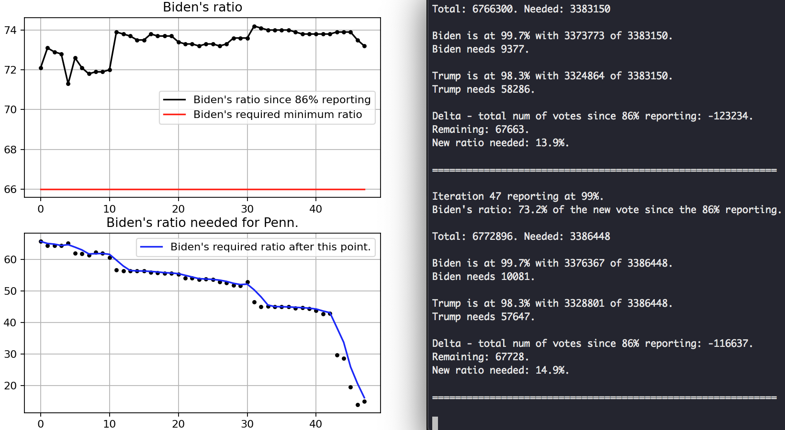

# penn-election
from 86% reporting onward, observe candidate momentum with knowledge that most vote-in-person
counting has finished and the remainder of the count is mail-in ballot. also, keep in mind
that mail-in voters and vote-in-person voters may lean towards different candidates.

This math model attempts to set a theshold for the required proportion of votes to go to
him in order for him to overtake the leading candidate. More explanations in
[Explanations](./Explanations).

Sample with two graphs and code output from last 2 iterations.

These are of course not the best models, and the x-axis is not necessarily linear.
Full graphs and outputs from 86% onwards:

[Figures](./figures.jpeg)

[Output](./penn.txt)

Pennsylvania was chosen at the time because there was a substantial percentage of the
vote left to tally as opposed to Georgia which was already at about 98%, updates were
occurring frequently unlike Nevada, and Pennsylvania's significant number of electoral
vote count.
